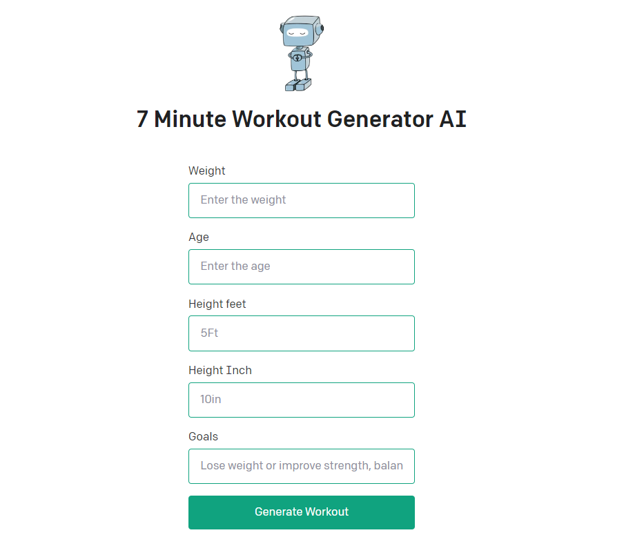

# 7 Minute Workout Generator AI- Node.js

This is a Workout generator app used in the OpenAI API [quickstart tutorial](https://beta.openai.com/docs/quickstart). It uses the [Next.js](https://nextjs.org/) framework with [React](https://reactjs.org/). Check out the tutorial or follow the instructions below to get set up.
 
## Usage

The AI can be accessed using a mobile device or web browser tailor to the user, After selecting the age, weight, height and goal, the user will be presented with a list of exercises to complete. 

## Features

- Generates 12 exercises for a 7 minute workout
- Allows for customization based on some characteristics
- Accessible on mobile devices and web browsers

## System Requirements

- Internet connection
- Web browser 
- Mobile device 
## Setup

1. If you don’t have Node.js installed, [install it from here](https://nodejs.org/en/) (Node.js version >= 14.6.0 required)

2. Clone this repository

3. Navigate into the project directory

   ```bash
   $ cd aiwokoutrestapi
   ```

4. Install the requirements

   ```bash
   $ npm install
   ```

5. Make a copy of the example environment variables file

   On Linux systems: 
   ```bash
   $ cp .env.example .env
   ```
   On Windows:
   ```powershell
   $ copy .env.example .env
   ```
6. Add your [API key](https://beta.openai.com/account/api-keys) to the newly created `.env` file

7. Run the app

   ```bash
   $ npm run dev
   ```

You should now be able to access the app at [http://localhost:3000](http://localhost:3000)! For the full context behind this example app, check out the [tutorial](https://beta.openai.com/docs/quickstart).


